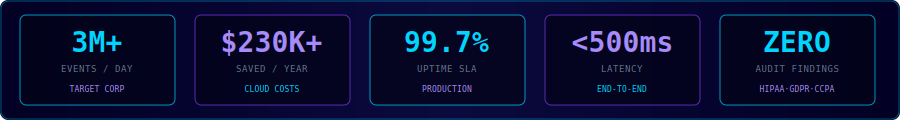

<div align="center">


<br/>


<br/><br/>

<a href="https://linkedin.com/in/phaneendra-kumar-srungarapu"></a>
<a href="mailto:phaneendra.srungarapu1@gmail.com"></a>


</div>

<br/>


<div align="center">

### `[ IMPACT AT A GLANCE ]`



</div>


### `> whoami`

```yaml
name     : Phaneendra Kumar Srungarapu
role     : Senior Data Engineer
employer : Target Corporation  |  Aug 2024 – Present
location : Dayton, Ohio
cloud    : AWS  +  Azure  +  GCP  (certified on all three)
stack    : Kafka · Spark · dbt · Snowflake · Databricks · Airflow · Terraform
certs    : [AWS DEA-C01, GCP Pro DE, Databricks, Snowflake SnowPro, dbt]
contact  : phaneendra.srungarapu1@gmail.com  |  (937) 231-0449
```


### `> experience --full`

**◈ Target Corporation** — Senior Data Engineer `Aug 2024 – Present`
> Kafka + Azure Databricks processing 3M+ daily retail transactions with sub-500ms latency. Delta Lake medallion architecture. dbt Mesh across inventory, pricing, fulfillment at 99.7% SLA. Microsoft Purview across 500+ datasets. Terraform + Helm on AKS: deploy time 4hr → 22min. $120K/yr Synapse savings.

**◈ Liberty Mutual Insurance** — Data Engineer `Feb 2021 – Jul 2023`
> Kafka Streams fraud detection sub-200ms across 500K+ daily transactions. MLflow A/B testing cut false-positive fraud 18%. 3 zero-finding HIPAA audits. Airflow replaced 40+ cron jobs, cutting failures 67%. $90K/yr savings.

**◈ Molina Healthcare** — Data Engineer `Feb 2020 – Jan 2021`
> PySpark ETL for 500K+ member records. 100% on-time CMS/HEDIS regulatory submissions. HIPAA PII masking via Azure Key Vault. Datadog cut MTTD 55%. $20K/yr savings.


### `> projects --top 4`

<table>
<tr>
<td width="50%" valign="top">

**⚡ Real-Time Market Analytics**
*Target · 2024*

500K+ events/min · Kafka → Spark → Delta Lake → Snowflake · 150+ dbt tests · Sub-600ms latency · 99.9% uptime · MTTD down 70%

`Kafka` `PySpark` `Delta Lake` `Snowflake` `dbt` `Terraform` `Grafana`

</td>
<td width="50%" valign="top">

**🛡 Automated Data Quality Framework**
*Liberty Mutual · 2022*

300+ validation rules · Great Expectations + Monte Carlo + OpenLineage · FastAPI + Streamlit · Kubernetes CI/CD

`Great Expectations` `Monte Carlo` `FastAPI` `Streamlit` `Docker` `K8s`

</td>
</tr>
<tr>
<td width="50%" valign="top">

**🏥 Healthcare Data Lakehouse**
*Molina · 2020*

5M+ daily records · HL7/FHIR → Iceberg → Redshift · HIPAA tokenization · SageMaker risk models · 99.95% SLA

`PySpark` `Iceberg` `AWS Glue` `Redshift` `SageMaker` `Terraform`

</td>
<td width="50%" valign="top">

**🔴 Fraud Signal Detection Engine**
*Liberty Mutual · 2021*

500K+ txns/day · Exactly-once semantics · Sub-200ms alerts · False-positive down 18% via MLflow A/B

`Kafka Streams` `Spark` `Databricks` `Feast` `MLflow` `Key Vault`

</td>
</tr>
</table>


### `> tech --arsenal`

<div align="center">


&nbsp;&nbsp;&nbsp;

&nbsp;&nbsp;&nbsp;


</div>


### `> certifications --list`

<div align="center">


</div>


### `> github --stats`

<div align="center">


&nbsp;


<br/><br/>


<br/>


<br/>

<picture>
  <source media="(prefers-color-scheme: dark)" srcset="https://raw.githubusercontent.com/Phaneendrakumar9/Phaneendrakumar9/output/github-contribution-grid-snake-dark.svg"/>
  <source media="(prefers-color-scheme: light)" srcset="https://raw.githubusercontent.com/Phaneendrakumar9/Phaneendrakumar9/output/github-contribution-grid-snake.svg"/>
  
</picture>

</div>


<div align="center">


</div>
